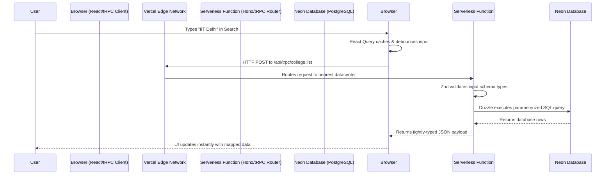
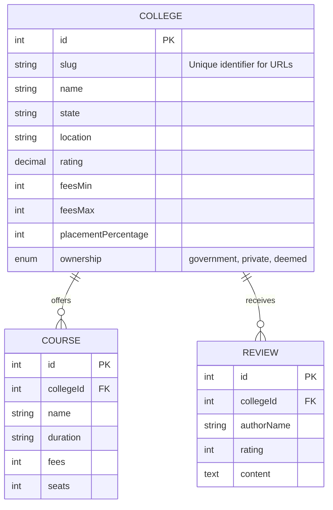

# CampusFind: Deep-Dive Technical Architecture & Engineering Documentation

**Purpose of this Document:** This document provides a comprehensive, in-depth explanation of the CampusFind platform's architecture. It is designed to explain not just *what* technologies were used, but *why* they were chosen, how they interact at a granular level, and the engineering principles behind the platform.

---

## 1. Executive Summary & Vision

**CampusFind** is a modern, high-performance web application designed to solve the fragmented and overwhelming process of college discovery in India. By providing instantaneous search, side-by-side comparisons, and a rank-based college predictor, it empowers students to make data-driven educational decisions.

From an engineering perspective, CampusFind is built as a **Monolithic Full-Stack TypeScript Application**. The primary engineering goal was to achieve **End-to-End Type Safety**—meaning a change in the database schema instantly alerts the frontend developer if a UI component breaks, all without generating intermediate types (like GraphQL) or maintaining separate repositories.

---

## 2. Core Technology Stack: The "Why"

The stack was meticulously chosen to balance developer velocity, extreme runtime performance, and scalable cloud deployment.

### Frontend (The User Interface)
*   **React 19 & Vite:** React 19 provides the latest concurrent rendering features, while Vite offers blazing-fast module replacement during development and highly optimized rollup bundles for production.
*   **Tailwind CSS & Radix UI:** Tailwind allows for rapid, utility-first styling without context-switching. Radix UI provides the unstyled, fully accessible foundational components (Dropdowns, Accordions, Modals) ensuring the platform works flawlessly for keyboard and screen-reader users.
*   **Framer Motion / GSAP:** Used for micro-interactions and scroll-based reveal animations, creating a "premium" feel that engages users visually without blocking the main thread.

### Backend (The Application Logic)
*   **tRPC (TypeScript Remote Procedure Call):** The backbone of the application. It replaces REST or GraphQL by allowing the frontend to call backend functions directly while inheriting their exact TypeScript types.
*   **Hono (via `@hono/node-server`):** An ultrafast, lightweight web framework designed originally for Edge runtimes (like Cloudflare Workers). It acts as the HTTP server that wraps the tRPC routes, ensuring minimal overhead and fast cold-start times.

### Data Layer
*   **PostgreSQL (Hosted on Neon Serverless):** A robust relational database chosen for its ability to handle complex relational queries (e.g., filtering colleges by fees, state, and rating simultaneously). Neon provides "Serverless Postgres", meaning it scales compute to zero when inactive and spins up instantly, perfect for Vercel's serverless environment.
*   **Drizzle ORM:** A lightweight, highly performant Object-Relational Mapper. Unlike Prisma (which uses a Rust binary engine that can bloat serverless functions), Drizzle maps TypeScript directly to SQL, resulting in smaller bundle sizes and predictable, fast queries.

---

## 3. High-Level System Architecture Flow

The following diagram illustrates how a user's action in the browser travels through the stack to the database and back.

---

## 4. Deep Dive: End-to-End Type Safety

The most powerful architectural feature of CampusFind is the **tRPC Data Bridge**. In a traditional REST API, the backend sends a JSON payload, and the frontend developer has to manually guess or write a TypeScript `interface` to match it. This leads to bugs if the backend changes a field name.

**How CampusFind solves this:**
1.  **Database Definition:** In `db/schema.ts`, a `colleges` table is defined using Drizzle.
2.  **Backend Router:** In `collegeRouter.ts`, a query asks Drizzle to `select().from(colleges)`. TypeScript automatically infers the shape of the returning array.
3.  **Frontend Hook:** In the React component, `trpc.college.list.useQuery()` is called. Because the frontend and backend live in the same repository, the tRPC client reaches across the folder structure, reads the inferred type from the backend router, and applies it to the React component.
4.  **Result:** If a backend engineer renames `feesMin` to `minimumFees` in the database, the React component throws a red squiggly error line instantly at compile-time. **Zero runtime surprises.**

---

## 5. Database Entity Relationship (ER) Architecture

CampusFind utilizes a normalized relational schema.

---

## 6. Engineering Specific Features

### A. The Search & Filtering Engine
The filter engine does not rely on simple string matching. The frontend sends a complex payload (e.g., `locations: ["Delhi", "Mumbai"], feesMax: 500000`). 
The backend utilizes Drizzle ORM to dynamically build an array of SQL `WHERE` conditions. If a filter is present, it is pushed to the conditions array. Finally, it uses `and(...conditions)` to execute a single, highly optimized SQL query. This dynamic composition ensures the database only does the exact work required.

### B. The College Predictor Algorithm
The Predictor feature is a standout engineering component. It takes a student's competitive exam rank and demographic category. 
Instead of sending all colleges to the client, the backend executes an algorithmic query: it searches the database for historical `closingRank` thresholds. It filters out any college where the student's rank is mathematically higher than the college's historical closing rank for that specific demographic category, returning only statistically viable options.

---

## 7. Deployment & Infrastructure Architecture

CampusFind is deployed on **Vercel**, utilizing a Serverless architecture.

*   **Static Asset Delivery (CDN):** When Vite builds the React app, it generates static HTML, CSS, and JS. These are deployed to Vercel's Edge Network, meaning users download the UI from a server physically closest to them (e.g., a node in Mumbai).
*   **The API Layer (`/api/index.ts`):** The entire Node.js backend is compiled by `esbuild` into a single file and deployed as a **Vercel Serverless Function**. It does not run 24/7. When a user requests data, Vercel spins up a micro-container in milliseconds, executes the tRPC logic, and shuts down.
*   **Connection Pooling:** A common problem with Serverless Functions is that thousands of concurrent users can open thousands of simultaneous connections to the database, crashing it. CampusFind solves this by using Neon DB's **Transaction Pooler**. The connection string (`DATABASE_URL`) routes traffic through a PgBouncer-like pooler, safely multiplexing thousands of serverless requests into a few persistent database connections.
